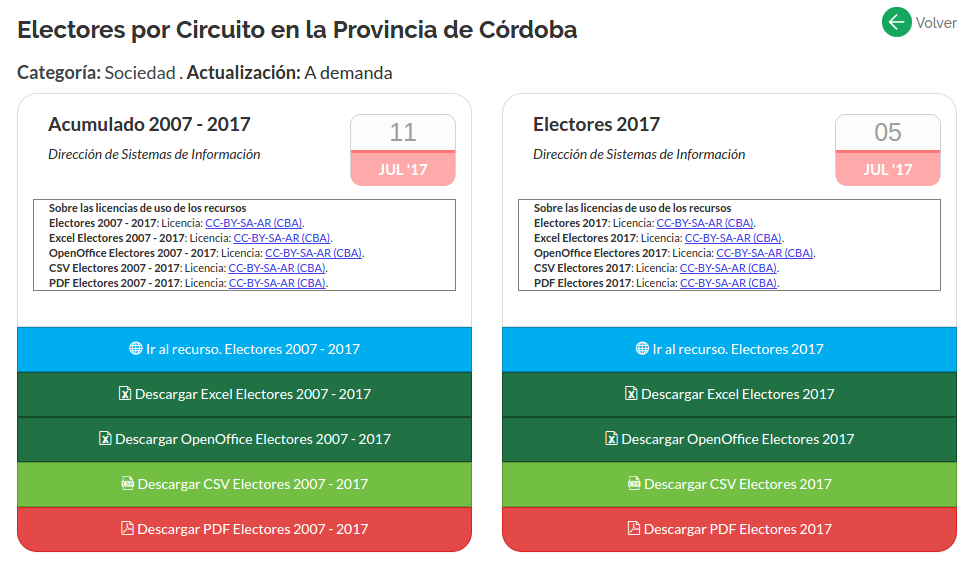

# Visualizaciones de electores por Circuito en Córdoba

Visualización desarrollada originalmente por Ariel Aizemberg ([@aaizemberg](https://github.com/aaizemberg), disponible [aquí](https://aaizemberg.github.io/vis/cordoba/)).  
Desarrollada en base a la recopilación de [datos sobre el histórico de electores en la Provincia de Córdoba](https://gobiernoabierto.cordoba.gob.ar/data/datos-abiertos/categoria/sociedad/electores-por-circuito-en-la-provincia-de-cordoba/216).  

Esta visualización permite conocer la distribución de los electores de Córdoba dentro de cada uno de los 26 departamentos de Córdoba.  

